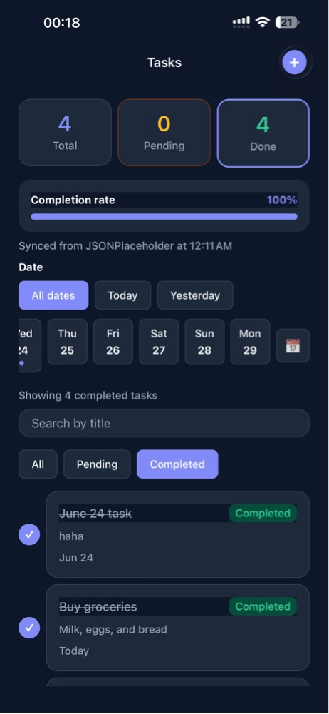
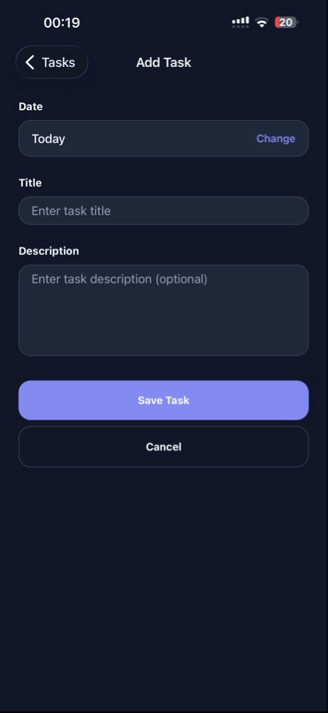
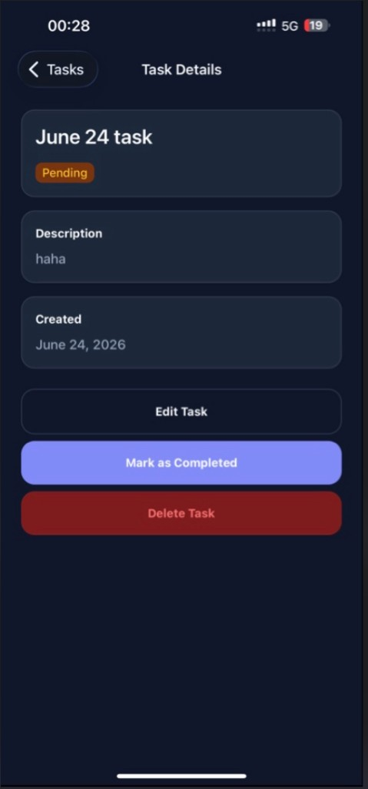

# Pritech React Native Task Manager

A modern React Native task management app built with Expo SDK 54, TypeScript, and Expo Router.

## Features

### Core requirements
- Task list with interactive stats dashboard (total, pending, completed, completion %)
- Add and **edit** tasks with title and description validation
- Mark tasks as completed or pending
- Delete tasks
- Task details screen
- **Fetch from public API** — [JSONPlaceholder](https://jsonplaceholder.typicode.com/todos?_limit=3) on every launch and pull-to-refresh; live API titles under **"Fetched from public API"**
- **Mock tasks** — 3 seeded English demo tasks under **"Mock tasks"**
- **Your tasks** — user-created tasks in their own section
- Empty, loading, and error states

### API integration
- Endpoint: `https://jsonplaceholder.typicode.com/todos?_limit=3`
- Displays real API fields: `id`, `title`, and `completed` (mapped to task status)
- Pull-to-refresh re-syncs from the API while keeping mock and user-created tasks
- List split into three sections: **Fetched from public API**, **Mock tasks**, and **Your tasks**
- Sync time shown under the API section header: "Synced from JSONPlaceholder at [time]"

### Example API tasks (from JSONPlaceholder)
- delectus aut autem
- quis ut nam facilis et officia qui
- fugiat veniam minus

### Mock tasks (seeded in app)
- Buy groceries (today)
- Code today (today)
- Finish that task today (yesterday)

### Bonus features
- Search tasks by title
- Filter by status via dashboard stat cards or filter chips
- **Filter by date** — All dates / Today / Yesterday (stats and list scoped to selected day)
- Persist tasks locally with AsyncStorage
- Stack navigation between list, details, add, and edit screens

### UI extras
- Modern indigo/slate color system with soft dark mode (no pure black)
- Tap Total / Pending / Done stat cards to filter by status
- Relative dates on list items (Today, Yesterday)
- Contextual filter summary (e.g. "Showing 2 tasks for today")
- Live completion progress bar scoped to the selected date filter

## Requirements

- Node.js 20+
- npm
- [Expo Go](https://expo.dev/go) on your phone (SDK 54 — available on the App Store / Play Store)

## Setup

1. Clone the repository and install dependencies:

   ```bash
   npm install
   ```

2. Start the development server:

   ```bash
   npx expo start
   ```

3. Scan the QR code with Expo Go (Android) or the Camera app (iOS).

You can also run on web:

```bash
npx expo start --web
```

## Project structure

```
src/
  app/                 # Expo Router screens (list, details, add, edit)
  components/tasks/    # Task UI (list, form, dashboard, date filter)
  contexts/            # Shared React context providers
  hooks/               # Custom hooks
  services/
    api/               # JSONPlaceholder fetch, mapping, and merge
    storage/           # AsyncStorage persistence
  types/               # TypeScript interfaces
  utils/               # Validation, filters, stats, date formatting, merge
```

## Tech stack

- React Native + Expo SDK 54
- TypeScript
- Expo Router (stack navigation)
- JSONPlaceholder public API (`/todos?_limit=3`)
- AsyncStorage for on-device persistence

## Screenshots

**Home screen** — stats dashboard, date filter, search, and task list



**Add task** — form with date picker, title, and description fields



**Task details** — title, status, description, created date, and actions



## What was implemented

This app fulfills the Pritech React Native technical task: full CRUD task management (including edit), live JSONPlaceholder API sync on refresh, input validation, reusable components, hooks-based state, date-based filtering, and all four bonus features. The UI includes an interactive completion dashboard, relative dates, and a cohesive design system to demonstrate attention to detail beyond the minimum requirements.
